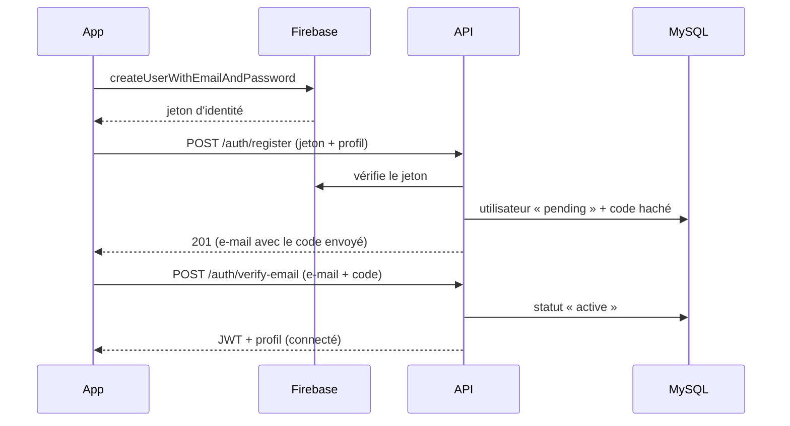

# Authentification : Firebase Auth + MySQL

## Principe

| Élément | Où ? |
|---|---|
| E-mail + mot de passe (création, connexion, réinitialisation) | **Firebase Auth** |
| Profil (nom, prénom, sexe, âge, téléphone, acteur, statut) | **MySQL** (table `users`) |
| Code d'activation à 6 chiffres | Généré par l'**API**, envoyé par **SMTP** (table `email_otps`, code haché) |
| Session utilisée par toutes les requêtes | JWT émis par l'**API** |

Firebase ne sait envoyer que des *liens* de vérification, pas des codes :
le code OTP est donc géré par l'API.



Connexion : l'application se connecte à Firebase, envoie le jeton à
`POST /auth/firebase`, et l'API renvoie son JWT si le compte est actif
(sinon `403` avec `details.code` = `account_pending` ou `account_suspended`).

**Désactivation par l'admin** (`PATCH /admin/users/:id/status`) : le statut MySQL
passe à `suspended` (effet immédiat : chaque requête relit le statut) et le
compte est aussi désactivé dans Firebase si le compte de service est configuré.

Les comptes de démo (`*@demo.local`) n'existent pas dans Firebase : l'application
les connecte par l'ancienne route `POST /auth/login` (mot de passe `Demo1234!`).

## 1. Créer le projet Firebase

1. <https://console.firebase.google.com> → **Ajouter un projet**.
2. **Authentication → Sign-in method** → activer **E-mail/Mot de passe**.
3. **Authentication → Templates** → langue **français** (e-mail « mot de passe oublié »).

## 2. Application Flutter

```bash
dart pub global activate flutterfire_cli
flutterfire configure --project=<id-du-projet>
```

La commande remplace `lib/firebase_options.dart` (actuellement un fichier provisoire)
et ajoute `google-services.json` pour Android. Relancer ensuite l'application.

Tant que ce n'est pas fait, l'application démarre mais l'inscription affiche
« Firebase n'est pas configuré » ; seuls les comptes de démo peuvent se connecter.

## 3. API (serveur Node)

Dans `server/.env` (et dans le tableau de bord Render) :

| Variable | Valeur |
|---|---|
| `FIREBASE_PROJECT_ID` | Identifiant du projet (suffit pour vérifier les jetons) |
| `FIREBASE_SERVICE_ACCOUNT` | Recommandé. Console → Paramètres du projet → Comptes de service → *Générer une clé privée* ; coller le JSON sur une ligne, ou encodé en base64. Nécessaire pour désactiver le compte dans Firebase et marquer l'e-mail vérifié. |
| `SMTP_HOST`, `SMTP_PORT`, `SMTP_SECURE`, `SMTP_USER`, `SMTP_PASSWORD` | Serveur d'envoi des codes (Gmail avec mot de passe d'application, Brevo, Mailjet…) |
| `MAIL_FROM` | Expéditeur, ex. `Partage+ <no-reply@mondomaine.com>` |

En local sans SMTP, le code est **affiché dans la console du serveur**.
En production, SMTP est obligatoire.

Puis `npm run db:migrate` : ajoute les nouvelles colonnes et tables sans perte
de données et crée les acteurs par défaut.

## Acteurs

L'administrateur les configure dans l'application (**Administration → Acteurs**,
route `/admin/actors`, API `/admin/actors`). Chaque acteur a des **droits** :

| Acteur par défaut | Droits | Proposé à l'inscription |
|---|---|---|
| Particulier | `beneficiary` (récupère des produits) | oui |
| Commerçant | `donor` (publie des produits) | oui |
| Restaurateur | `donor` | oui |
| Administrateur | `admin` | **jamais** (refusé par l'API) |

Protections : un acteur utilisé par des comptes ne peut être ni supprimé
(le désactiver à la place) ni changer de droits.
