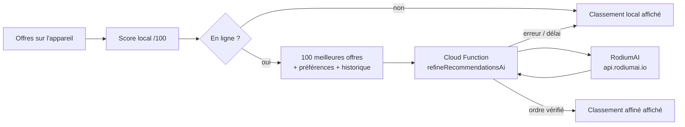

# Recommandations hybrides et IA (RodiumAI)

## Fonctionnement



**Niveau 1, sur l'appareil** (`lib/features/recommendations/domain/local_ranker.dart`) :
toujours calculé, hors ligne compris. Score sur 100 :

| Critère | Poids | Calcul |
|---|---|---|
| Distance | 30 % | 1 − distance / distance max. (haversine, point de départ choisi) |
| Catégorie | 25 % | 1 si catégorie recherchée ; sinon affinité issue de l'historique |
| Urgence (péremption) | 20 % | aujourd'hui 1 · demain 0,85 · 2 j 0,7 · 3 j 0,55 · ≤ 6 j 0,4 · au-delà 0,2 |
| Prix | 15 % | gratuit 1 ; sinon décroissant jusqu'au prix max. (0 au-delà) |
| Type de publieur | 10 % | commerçant/restaurateur 0,8 · particulier 0,65 · sans compte 0,5 ; 1 si type préféré |

**Niveau 2, par le LLM** : en ligne, les 100 premières offres, les préférences
(texte libre ou dictée) et un résumé de l'historique (titres consultés et réservés,
catégories favorites) sont envoyés à la Cloud Function, qui interroge RodiumAI.
La réponse est vérifiée : seuls des id de la liste envoyée sont acceptés, sans
doublon ; les offres non citées gardent leur ordre local.

**Repli** : hors ligne, erreur, quota dépassé, délai de 30 s dépassé ou IA non
configurée → le classement local reste affiché, avec un message. Au retour du
réseau, l'affinage est relancé automatiquement si l'écran est ouvert. Aucune de
ces erreurs ne remonte à l'utilisateur sous forme de plantage.

**Distances** : à vol d'oiseau (haversine), puis distance à parcourir estimée
(× 1,3) et temps de marche (4,5 km/h). Ce sont des estimations, sans service
d'itinéraire : pour le trajet réel, bouton « Itinéraire avec OsmAnd ».

**Regroupement géographique** (`lib/core/location/geo.dart`) : les offres à
moins d'un rayon donné du centre d'un groupe sont regroupées (algorithme glouton,
centre recalculé à chaque ajout). Sur la carte, le rayon suit le zoom (~60 px) :
les repères proches deviennent une bulle avec leur nombre. Dans les
recommandations, vue « par zone » (rayon 500 m).

## Windows, Linux, macOS et repli sans Firebase

Les paquets Firebase pour Flutter ne sont pas utilisables en production sur
ordinateur. L'application y passe par les **API HTTP officielles** de Firebase
(`lib/core/firebase/firebase_rest.dart`) avec la clé web de `firebase_options.dart` :

- inscription / connexion / mot de passe oublié : Identity Toolkit REST ;
- IA : appel HTTPS direct de la Cloud Function (protocole « callable »),
  avec une session anonyme renouvelée automatiquement.

**Repli complet sans Firebase** (non configuré, clé invalide, connexion
e-mail désactivée…) :

- **inscription** : compte local, mot de passe haché (bcrypt) dans MySQL, même
  code d'activation par e-mail ; connexion par `POST /api/auth/login` ;
  « mot de passe oublié » n'est pas disponible pour ces comptes ;
- **IA** : `POST /api/recommendations/refine` sur votre serveur. L'application
  n'envoie que les id des offres (et leur score local), les préférences, sa
  position et ses consultations ; le serveur relit titres, catégories, prix,
  dates et distances **dans MySQL**, ajoute l'historique de réservations du
  compte, puis interroge RodiumAI (même logique que la Cloud Function :
  `server/src/services/ai_refine.js`, copie vérifiée par les tests).

Ordre essayé partout : Cloud Function, puis IA du serveur, puis classement
local. Serveur : renseigner `RODIUM_API_KEY` dans `server/.env` (et sur Render).

## Mise en service

1. **Forfait Blaze** (paiement à l'usage) sur le projet `partageplus-f8840` :
   obligatoire pour qu'une Cloud Function appelle un service externe.
2. **Authentication → Sign-in method → Anonyme : activer.** La fonction exige
   une session Firebase ; les visiteurs sans compte en reçoivent une anonyme.
3. **Firestore** : base déjà créée ; elle sert au compteur d'appels (`ai_usage`,
   30 appels par heure et par utilisateur). Les règles fournies interdisent tout
   accès direct depuis l'application.
4. Clé RodiumAI dans Secret Manager (jamais dans l'application ni dans git) :

   ```bash
   firebase functions:secrets:set RODIUM_API_KEY   # coller la clé rd_sk_…
   ```

5. Modèle (facultatif, `openai/gpt-4o-mini` par défaut) : liste des modèles
   disponibles sur <https://www.rodiumai.io/models>. À la première mise en ligne,
   `firebase deploy` demande la valeur de `RODIUM_MODEL`.
6. Déploiement, depuis la racine du projet :

   ```bash
   cd functions && npm install && npm test && cd ..
   firebase deploy --only functions,firestore:rules
   ```

La fonction est déployée en `europe-west1` (même région dans l'application :
`CloudFunctionAiRefiner.region`).

## Publication express (restaurateurs)

En haut de « Publier une offre », les comptes **restaurateur** (acteur
`restaurateur`) voient une carte « Publication express » : ils décrivent leurs
invendus en une phrase (texte ou dictée), par exemple « 5 plats de riz gras,
gratuit, avant 20h », et le formulaire est pré-rempli : catégorie, titre,
description, quantité, unité, poids, prix, DLC, créneau. **Rien n'est publié** :
le restaurateur relit, corrige, puis publie comme d'habitude.

- Route : `POST /api/recommendations/offer-draft` (`server/src/services/offer_draft.js`),
  refusée (403) aux autres acteurs, même plafond `AI_CALLS_PER_HOUR`.
- L'application envoie le texte et son heure locale ; le modèle ne renvoie
  que des heures « HH:MM » et un nombre de jours, convertis en dates sur
  l'appareil (`draftDates`).
- Réponse contrôlée : catégorie prise dans la liste MySQL (sinon ignorée),
  quantité, poids, prix et DLC bornés, textes tronqués ; un champ douteux est
  laissé tel quel dans le formulaire.
- IA absente, en panne ou quota atteint : message, et le formulaire classique
  reste utilisable.

## Recherche à la voix (écran Recommandations)

Le micro enregistre la demande (« je veux du riz gras »). Un agent IA la
retranscrit, puis ne garde que les offres qui y répondent ; la retranscription
s'affiche dans le champ et un bandeau « Tout afficher » retire le filtre. Une
demande tapée au clavier (bouton « Recommander ») passe par le même agent.

Agents essayés dans l'ordre (le premier qui répond l'emporte) :

1. **IA ouverte du serveur** — `POST /api/recommendations/voice-search` :
   Whisper (retranscription) puis Llama (filtrage), via une API compatible
   OpenAI. **Groq** par défaut (palier gratuit). Toutes les plateformes.
2. **Gemini** (Firebase AI Logic) — Android et iOS, si le projet a des crédits.
3. **Mots-clés sur l'appareil** — toujours disponible, hors ligne compris
   (demande écrite ou dictée par la reconnaissance vocale du système).

L'application n'envoie que l'audio et les **id** des offres (avec leur
distance) : le serveur relit titres, prix et dates dans MySQL. Même limite
d'appels que l'IA de recommandation (`AI_CALLS_PER_HOUR`).

### Mise en service (serveur)

1. Créer une clé gratuite sur https://console.groq.com/keys (`gsk_…`).
2. Dans `server/.env` : `GROQ_API_KEY=gsk_…`, puis redémarrer l'API.
3. Facultatif : autre service compatible OpenAI avec `VOICE_AI_BASE_URL`,
   `VOICE_AI_STT_MODEL`, `VOICE_AI_LLM_MODEL` et `VOICE_AI_LABEL` (nom affiché).
   Ex. Ollama en local (`http://localhost:11434/v1`) pour le filtrage d'une
   demande écrite ; la retranscription demande un service Whisper.

Sans clé, la route répond 503 et l'application passe à Gemini, puis aux
mots-clés.

### Par plateforme

| Plateforme | Enregistrement | À configurer |
|---|---|---|
| Android | AAC (m4a) | Rien : permission `RECORD_AUDIO` déjà déclarée |
| iOS | AAC (m4a) | Rien : `NSMicrophoneUsageDescription` déjà dans `Info.plist` |
| macOS | AAC (m4a) | Rien : entitlement `device.audio-input` et `Info.plist` déjà en place |
| Windows | AAC (m4a) | Autoriser le micro aux applications de bureau (Paramètres → Confidentialité → Microphone) |
| Linux | AAC (m4a) | Installer les outils d'enregistrement : `sudo apt install pulseaudio-utils ffmpeg` |
| Web | Opus (WebM) | Servir l'application en **HTTPS** (ou `localhost`) : le navigateur refuse le micro sinon ; ajouter l'origine du site à `CORS_ORIGINS` si cette variable est renseignée |

Sur Linux et Windows, la dictée du système n'existe pas : sans enregistrement
possible, la demande se tape au clavier.

## Sécurité et confidentialité

- Recherche à la voix : l'enregistrement est envoyé au service d'IA configuré
  (Groq par défaut, ou Google pour Gemini) pour être retranscrit, puis le
  fichier temporaire est supprimé de l'appareil.
- La clé RodiumAI reste côté serveur (Secret Manager). L'application n'appelle que
  la fonction, avec une session Firebase.
- Recommandé ensuite : **Firebase App Check**, puis `enforceAppCheck: true` dans
  `functions/src/index.js`, pour que seule l'application officielle puisse l'appeler.
- Données envoyées au LLM : préférences saisies, titres d'offres consultées et
  réservées, catégories. Ni nom, ni téléphone, ni e-mail, ni position exacte
  (seulement des distances). Le texte saisi est traité comme une donnée non fiable :
  le prompt interdit au modèle de suivre des instructions qui s'y trouveraient.
- Coût : 1 appel par demande de recommandation (bouton, ouverture de l'écran,
  retour du réseau), plafonné à 30 par heure et par utilisateur.
